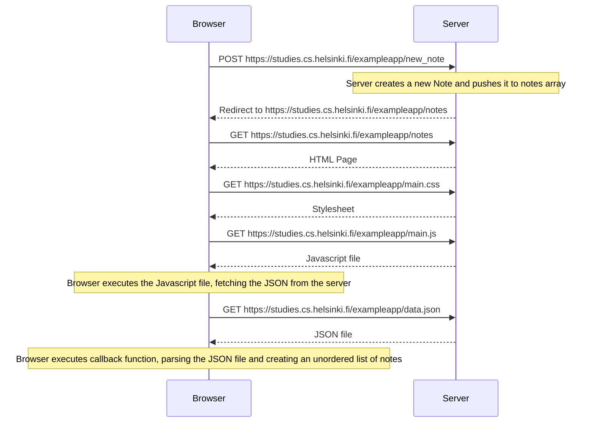

```mermaid
sequenceDiagram
    Browser->>Server: POST https://studies.cs.helsinki.fi/exampleapp/new_note
    Note over Server: Server creates a new Note and pushes it to notes array
    Server-->>Browser: Redirect to https://studies.cs.helsinki.fi/exampleapp/notes
    Browser->>Server: GET https://studies.cs.helsinki.fi/exampleapp/notes
    Server-->>Browser: HTML Page
    Browser->>Server: GET https://studies.cs.helsinki.fi/exampleapp/main.css
    Server-->>Browser: Stylesheet
    Browser->>Server: GET https://studies.cs.helsinki.fi/exampleapp/main.js
    Server-->>Browser: Javascript file
    Note over Browser: Browser executes the Javascript file, fetching the JSON from the server
    Browser->>Server: GET https://studies.cs.helsinki.fi/exampleapp/data.json
    Server-->>Browser: JSON file
    Note over Browser: Browser executes callback function, parsing the JSON file and creating an unordered list of notes

```
